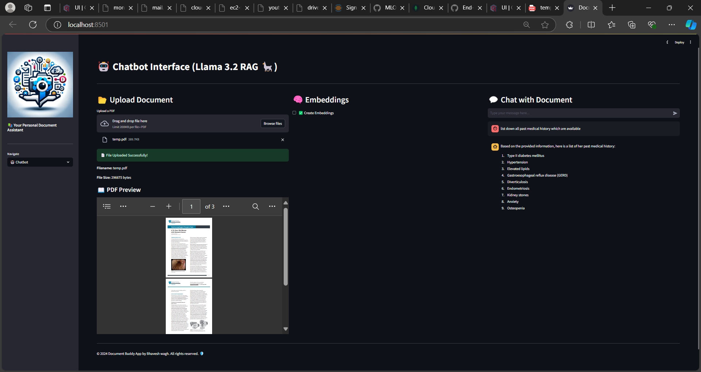

# Document-Buddy-App

Document Buddy App is a powerful Streamlit-based application designed to simplify document management. Upload your PDF documents, create embeddings for efficient retrieval, and interact with your documents through an intelligent chatbot interface. 🚀

- 📂 Upload Documents: Easily upload and preview your PDF documents within the app.
- 🧠 Create Embeddings: Generate embeddings for your documents to enable efficient search and retrieval.
- 🤖 Chatbot Interface: Interact with your documents using a smart chatbot that leverages the created embeddings.
- 📧 Contact: Get in touch with the developer or contribute to the project on GitHub.
- 🌟 User-Friendly Interface: Enjoy a sleek and intuitive UI with emojis and responsive design for enhanced user experience.